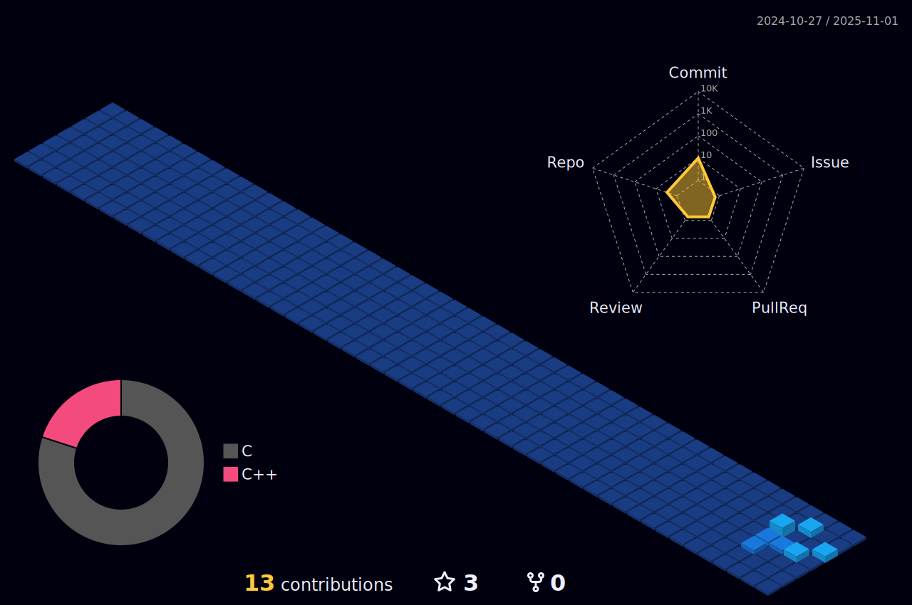

<div align="center">
  <h1 align="center">Hi there, I'm Nagesh! </h1>
  
  <a href="https://github.com/DenverCoder1/readme-typing-svg">
    
  </a>
</div>

<div align="center">
<p>
  <a href="https://in.linkedin.com/in/nagesh-n-nazare">
    
  </a>
</p>
</div>

---

### 🛠️ Languages and Tools

<div align="center">
  
  
  
  
  
  
  
</div>

---

### 📚 Featured Repos

<table align="center">
  <tr>
    <td align="center"><a href="https://github.com/nageshnnazare/cpp-know-hows"><b>cpp</b></a><br>c++ notes</td>
    <td align="center"><a href="https://github.com/nageshnnazare/cuda-know-hows"><b>cuda</b></a><br>gpu prgm</td>
    <td align="center"><a href="https://github.com/nageshnnazare/python-know-hows"><b>python</b></a><br>python tut</td>
    <td align="center"><a href="https://github.com/nageshnnazare/bash-know-hows"><b>bash</b></a><br>shell script</td>
    <td align="center"><a href="https://github.com/nageshnnazare/asm-know-hows"><b>asm</b></a><br>assembly</td>
  </tr>
  <tr>
    <td align="center"><a href="https://github.com/nageshnnazare/pytorch-know-hows"><b>pytorch</b></a><br>pytorch notebooks</td>
    <td align="center"><a href="https://github.com/nageshnnazare/ml-know-hows"><b>ml</b></a><br>machine learning</td>
    <td align="center"><a href="https://github.com/nageshnnazare/raylib-know-hows"><b>raylib</b></a><br>graphics</td>
    <td align="center"><a href="https://github.com/nageshnnazare/ncurses-know-hows"><b>ncurses</b></a><br>tui</td>
    <td align="center"><a href="https://github.com/nageshnnazare/tbb-know-hows"><b>tbb</b></a><br>threading</td>
  </tr>
  <tr>
    <td align="center"><a href="https://github.com/nageshnnazare/design-patterns-know-hows"><b>design-patterns</b></a><br>cpp architecture</td>
    <td align="center"><a href="https://github.com/nageshnnazare/lld-know-hows"><b>lld</b></a><br>low level design</td>
    <td align="center"><a href="https://github.com/nageshnnazare/os-know-hows"><b>os</b></a><br>operating system</td>
    <td align="center"><a href="https://github.com/nageshnnazare/dsa-know-hows"><b>dsa</b></a><br>data structures</td>
    <td align="center"><a href="https://github.com/nageshnnazare/unix_threads_with_pthread_lib"><b>pthread</b></a><br>unix threads</td>
  </tr>
</table>

---

### 🏆 Contributions

<!-- ASCII_CONTRIBUTION_START -->
```text
   0 1 2 3 4 5 6 7 8 9 0 1 2 3 4 5 6 7 8 9 0 1 2 3 4 5 6 7 8 9
Sun                                                           ░
Mon                                       ░               ▓ ░  
Tue                                     ▒     ░         ▓ ▓ ░  
Wed                                     ░ ░ ░         ▒ ▓   ░ ▒
Thu                                     ░               ▒ ░   ░
Fri                                                     ▒   ▒ ▒
Sat                                                         ▓ ▓
```
<!-- ASCII_CONTRIBUTION_END -->

---

<!-- <div align="center">


</div>

--- -->

<!-- <div align="center">
  
</div> -->